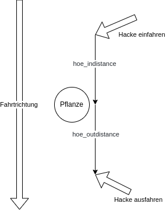

# Befehle

## NTRIP

| Befehl | Beschreibung |
| ------ | ------------ |
| ntrip set caster openservice-sapos.niedersachsen.de | Setzt den NTRIP Caster auf openservice-sapos.niedersachsen.de |
| ntrip set caster | Gibt den aktullen NTRIP Caster zurück |
| ntrip set mountpoint VRS_3_3G_NI | Setzt den NTRIP mountpoint auf VRS_3_3G_NI |
| ntrip set mountpoint | Gibt den aktuellen NTRIP Mountpoint zurück |
| ntrip set password test | Setzt das NTRIP Passwort auf test |
| ntrip set password | Gibt das aktuelle NTRIP Passwort zurück |
| ntrip set port 2101 | Setzt den NTRIP Port auf 2101 |
| ntrip set port | Gibt den aktuellen NTRIP Port zurück |
| ntrip set username test | Setzt den NTRIP Benutzernamen auf test |
| ntrip set username | Gibt den aktuellen NTRIP Benutzernamen zurück |
| ntrip stop | Stoppt den NTRIP Service |
| ntrip start | Startet den NTRIP Service |

## FELDROBOTER

| Befehl | Beschreibung |
| ------ | ------------ |
| ethtrigger set hoeindistance 0.1 | Setzt die Entfernung auf 0.1 Meter vor dem die Hacke vor der Pflanze eingefahren wird |
| ethtrigger set hoeindistance | Gibt die hoeindistance zurück |
| ethtrigger set hoeoutdistance 0.03 | Setzt die Entfernung auf Meter 0.03 Meter nachdem die Hacke nach der Pflanze ausgefahren wird | 
| ethtrigger set hoeoutdistance | Gibt die hoeoutdistance zurück |
| ethtrigger set hoemaxdistance 2.1 | Setzt die maximale Entfernung auf 2.1 Meter zu einer Pflanze, wird diese Entfernung überschritten, dann geht der Betriebsmode 3 in Störung (wenn man an einer Pflanze vorbei fährt) |
| ethtrigger set hoemaxdistance | Gibt die hoemaxdistance zurück |
| ethtrigger set steps | Setzt die Anzahl der Motorschritte für die Sähmaschine |
| ethtrigger set steps | Gibt die Anzahl der Motorschritte für die Sähmaschine zurück |
| ethtrigger set stepshoe | Setzt die Anzahl der Motorschritte für die Hacke |
| ethtrigger set stepshoe | Gibt die Anzahl der Motorschritte für die Hacke zurück |
| ethtrigger set mode 1 | Setzt den Betriebmode des Feldroboters auf 1 |
| ethtrigger set mode | Gibt den aktuelle Betriebmode des Feldroboters zurück |
| ethtrigger set seedfile /home/pi/data/webaro/seed.txt | Setzt die Datendatei auf /home/pi/data/webaro/seed.txt |
| ethtrigger set seedfile | Gibt die aktuelle Datendatei zurück |
| ethtrigger seed hoe_home | Fährt die Hacke in die Home Position |
| ethtrigger seed hoe_move | Fährt die Hacke in die nächste Position |
| ethtrigger seed seed_home | Fährt die Sämaschine in die Home Position |
| ethtrigger seed seed_move | Aktiviert die Sämaschine Auswurf ein Saatkorn |
| ethtrigger seed read | Liest Daten aus der Datendatei ein |
| ethtrigger seed write | Schreibt Daten in Datendatei |
| ethtrigger seed reset | Setzt den Betriebsmode 3 zurück |

### Betriebsmode

| Betriebsmode | Beschreibung |
| ------ | ------------ |
| 0 | Kein Sähnen und kein Hacken |
| 1 | Sähnen, keine Datenaufnahme |
| 2 | Sähnen, Positionen der Pflanzen werden aufgenommen |
| 3 | Hacken |
